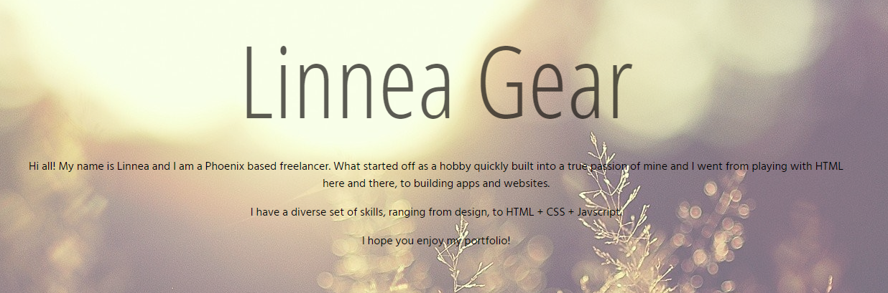

## Deployed Link

[My Portfolio](https://linneagear.github.io/portfolio/)

## Updated Portfolio

My updated portfolio has the following content:

* Your name

* Links to your GitHub profile & LinkedIn page as well as your email address and phone number

* A link to a PDF of your resume

* A list of projects. For each project, make sure you have the following:

  * Project title

  * Link to the deployed version

  * Link to the GitHub repository

  * Screenshot of the deployed application

## Design

* Mobile-first design

* Light, whimsical color scheme to fit my style

* Simple and effective theme
